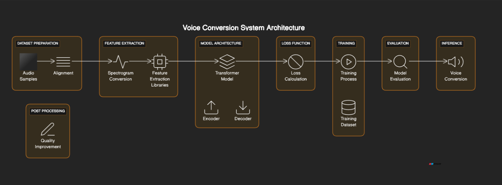

# Voice Conversion with Transformer Model

## Overview

This project focuses on using a transformer model to perform voice conversion, transforming male voices to female voices. The goal is to create a model capable of learning the subtle nuances of the female voice and applying them to male speech patterns.

## Conversion Procedure

### 1. Dataset Preparation

Prepare a dataset containing pairs of male and female audio samples, where each pair corresponds to the same sentence spoken by both genders. Ensure that the dataset is well-aligned, meaning that corresponding sentences match in timing and duration.

### 2. Feature Extraction

Convert each audio sample into a spectrogram using tools like `librosa` or `torchaudio`. Extract additional features such as pitch, formants, or any other relevant information that aids voice conversion.

### 3. Model Architecture

Design a transformer model for voice conversion. The model should take male spectrograms as input and generate transformed (female-like) spectrograms as output. Consider using an encoder-decoder architecture.

### 4. Loss Function

Define a loss function that measures the difference between the generated spectrogram and the target (female) spectrogram. Common choices include mean squared error (MSE) or other spectrogram distance measures.

### 5. Training

Train the transformer model on the prepared dataset using the defined loss function. Use pairs of male and female spectrograms as input and target during training. Monitor the loss to ensure effective learning.

### 6. Evaluation

Evaluate the trained model on a separate set of male and female audio pairs not seen during training to assess generalization performance.

### 7. Inference

Use the trained model for voice conversion by inputting male spectrograms and generating corresponding female-like spectrograms.

### 8. Post-Processing (Optional)
